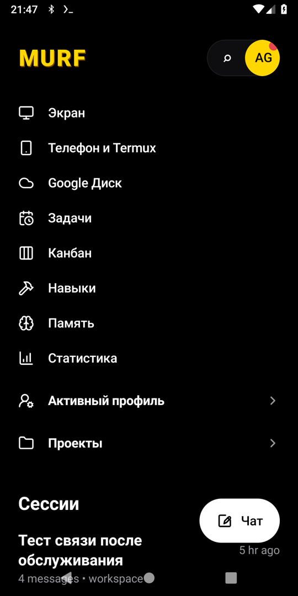
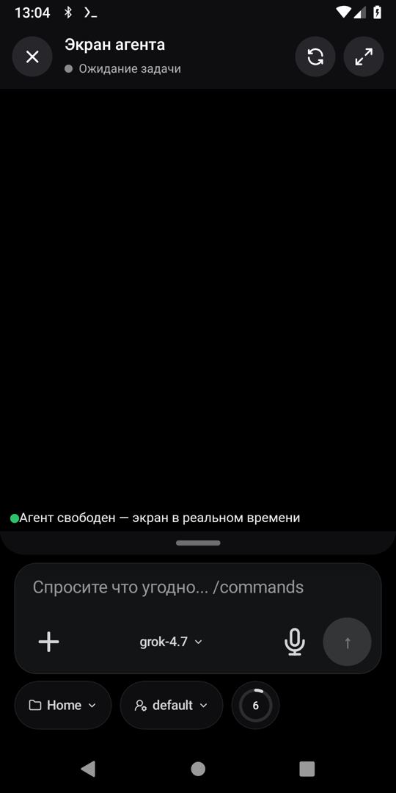
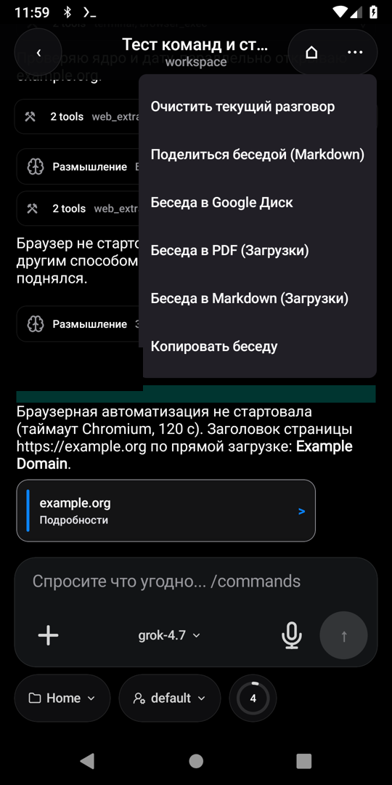
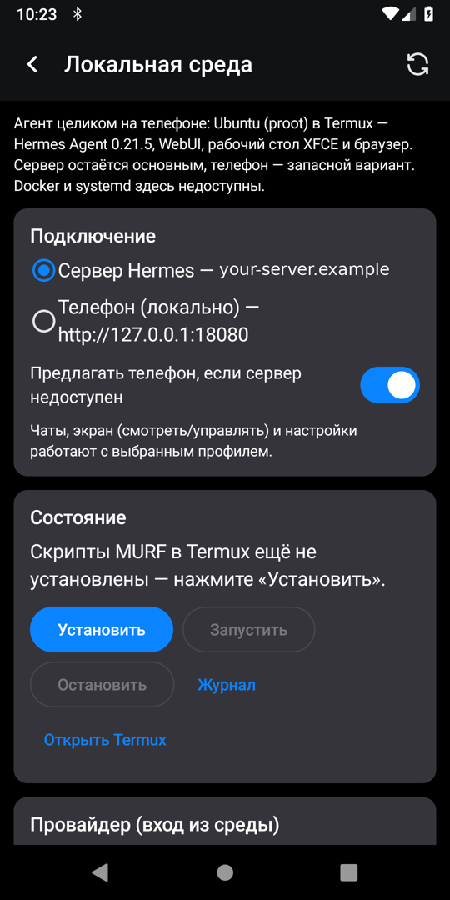
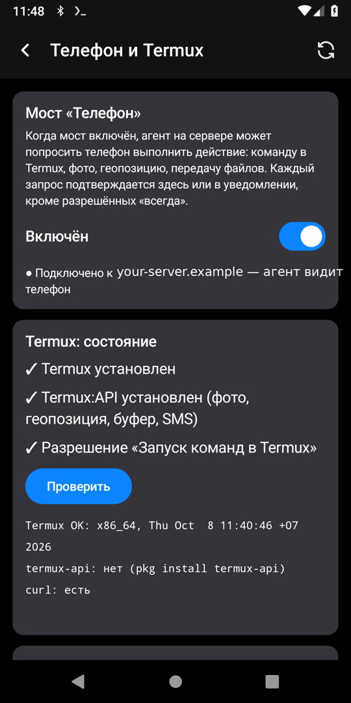
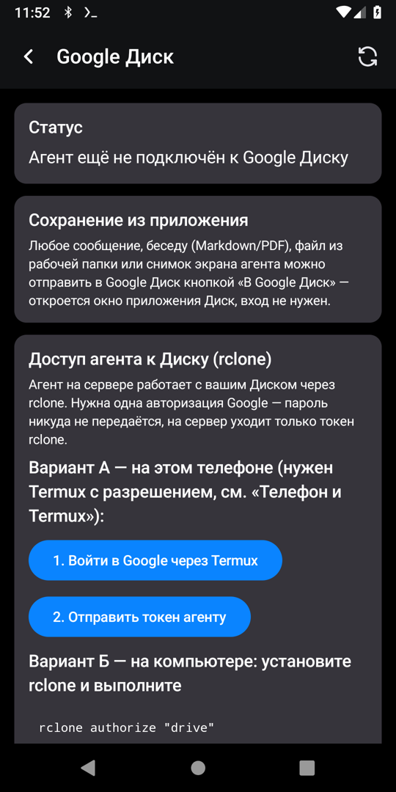
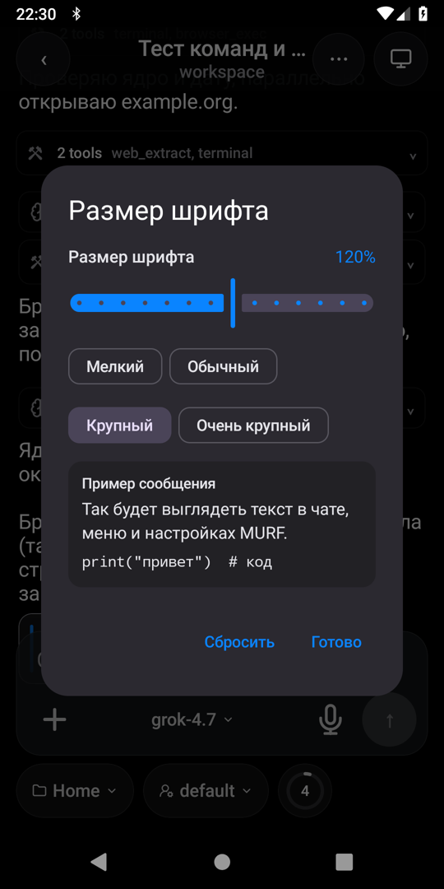

<p align="center"></p>

# MURF

**MURF** — Android-клиент для своего ИИ-агента на базе [Hermes Agent](https://github.com/NousResearch/hermes-agent) и [hermes-webui](https://github.com/nesquena/hermes-webui).
Это форк [Hermex](https://github.com/uzairansaruzi/hermex) (нативный клиент hermes-webui) с упором на работу с телефона: живой экран агента, мост к телефону через Termux, локальный режим «весь агент на телефоне».

> English summary is [below](#english).

| Главное меню | Экран агента в чате | Экспорт беседы | Локальный режим |
|---|---|---|---|
|  |  |  |  |

| Телефон и Termux | Google Диск | Размер шрифта | Язык |
|---|---|---|---|
|  |  |  |  |

## Возможности

- **Чат с агентом** — потоковые ответы, шаги инструментов, мышление, **субагенты**, **подтверждения** опасных действий (в чате и уведомлением).
- **Живой экран агента** (noVNC): режимы «Смотреть» и «Управлять» — тап = клик, удержание = правый клик, два пальца = прокрутка, зум, панель клавиш (Esc/Tab/Ctrl/Alt/Shift/Enter), ввод кириллицы; экран можно открыть поверх чата.
- **Мост «Телефон»** — агент на сервере просит телефон выполнить действие (команда в Termux, фото, геопозиция, файлы, буфер обмена, уведомления, батарея, SMS по желанию); каждое действие подтверждается, кроме разрешённых «всегда».
- **Google Диск** — отправка сообщений, бесед, файлов и снимков экрана в Диск; подключение Диска к агенту через rclone (токен, без пароля).
- **Экспорт** — беседа в Markdown/PDF/буфер, «Поделиться», сохранение в Загрузки.
- **Размер шрифта** для всего приложения, **свайпы** между разделами и к экрану агента.
- **Проверка обновлений** сервера: Hermes Agent и WebUI, пробный запуск, резервная копия и автоматический откат.
- **Локальный режим** — весь агент на телефоне: Ubuntu (proot) в Termux, Hermes Agent, WebUI, рабочий стол XFCE + браузер, вход в провайдера (device code) прямо из среды; переключение профиля «Сервер / Телефон (локально)» и предложение переключиться, если сервер недоступен.
- **Язык приложения** — «Как в системе» или любой из встроенных языков (на Android 13+ также в системных настройках языка приложения). Новые экраны MURF переведены на русский и английский; для остальных языков они показываются по-английски.
- Всё, что умеет Hermex: сессии, проекты, задачи, канбан, навыки, память, статистика, несколько серверов и профилей.

## Архитектура

```mermaid
flowchart LR
  subgraph Phone["Телефон"]
    App["MURF (Android)"]
    Termux["Termux (+ Termux:API)"]
    Local["Локальный режим:<br>Ubuntu proot → Hermes + WebUI + XFCE"]
  end
  subgraph Server["Сервер"]
    Nginx["nginx (TLS)<br>/  /agent/  /screen/  /phone/"]
    WebUI["hermes-webui :8787"]
    Agent["Hermes Agent<br>(gateway, API :8642)"]
    Desk["Рабочий стол агента<br>Xvnc + websockify/noVNC"]
    Relay["phone-relay :8790/:8791"]
  end
  App -- HTTPS / SSE --> Nginx
  App -- WebSocket (RFB) --> Nginx
  Nginx --> WebUI --> Agent
  Nginx --> Desk
  Nginx --> Relay
  Agent -- MCP agent_tools --> Relay
  Relay -. запросы к телефону .-> App
  App -- RUN_COMMAND --> Termux
  App -. http://127.0.0.1:18080 .-> Local
```

## Сборка

Нужны JDK 17 и Android SDK (platform 36).

```bash
cd android
./gradlew assembleDebug                      # app/build/outputs/apk/debug/
# адрес сервера по умолчанию на экране подключения (необязательно):
./gradlew assembleDebug -Pmurf.defaultServerUrl=https://your-server.example
```

Подписанный релиз: задайте `HERMEX_ANDROID_KEYSTORE_FILE`, `HERMEX_ANDROID_KEY_ALIAS` и пароли хранилища ключей через переменные окружения или `~/.gradle/gradle.properties` (никогда не в репозитории), затем `./gradlew assembleRelease`.

`applicationId` — `ru.dredd20.agent` (оставлен ради обновлений поверх уже установленных сборок). Для своей сборки смените его в `android/app/build.gradle.kts`.

## Сервер

Нужен свой сервер с Hermes Agent и hermes-webui; MURF подключается к нему по HTTPS с паролем WebUI. Примеры конфигураций (с заглушками `your-server.example`) — в [`server/`](server/README.md):

- `server/examples/nginx-murf.conf` — nginx: WebUI, API агента, экран, мост «Телефон»;
- `server/agent-screen/` — страница экрана (noVNC), прокси «только просмотр», unit-файлы systemd;
- `server/phone-relay/` — мост «Телефон» и MCP-сервер `agent_tools` для агента;
- `server/local-mode/` — скрипты локального режима (Termux + proot).

## Локальный режим

1. Установите [Termux](https://f-droid.org/packages/com.termux/) (F-Droid/GitHub) и выдайте MURF разрешение «Запуск команд в Termux» (раздел «Телефон и Termux»).
2. Меню → «Локальная среда» → «Установить» (≈4 ГБ, нужно ≥ 4,5 ГБ свободного места; 20–60 мин).
3. Батарея: MURF и Termux — «Без ограничений»; в параметрах разработчика — «Отключить ограничения дочерних процессов» (Android 12+).
4. «Запустить» → «Войти в провайдера» → откройте ссылку и подтвердите код.
5. Переключите профиль на «Телефон (локально)».

Вручную: `curl -fsSL https://github.com/winnifredbalistreri60-prog/murf/releases/latest/download/install.sh | bash`, затем `murf-local install && murf-local start`.

Ограничения: проверено в x86_64 proot; на реальном arm64-телефоне требуется проверка; на Android 9 и старых ядрах Ubuntu 24.04 в proot не работает. Docker и systemd недоступны.

## Безопасность

- Пароль WebUI и cookie хранятся в зашифрованном хранилище (EncryptedSharedPreferences); секреты в репозитории не хранятся.
- Экран агента и API моста закрыты авторизацией WebUI (nginx `auth_request`), управление экраном — только с вашего Origin.
- Каждое действие на телефоне подтверждается; ссылки для файлов одноразовые и короткоживущие.
- Локальный режим слушает только `127.0.0.1`; перенос секретов с сервера — только после отдельного подтверждения.

Сообщить об уязвимости: см. [SECURITY.md](SECURITY.md).

## Благодарности

[Hermex](https://github.com/uzairansaruzi/hermex) (Uzair Ansar) · [Hermes Agent](https://github.com/NousResearch/hermes-agent) (Nous Research) · [hermes-webui](https://github.com/nesquena/hermes-webui) · [noVNC](https://github.com/novnc/noVNC) · [Termux](https://termux.dev). Подробнее — [NOTICE.md](NOTICE.md).

Лицензия — [MIT](LICENSE).

---

## English

**MURF** is an Android client for your own AI agent built on [Hermes Agent](https://github.com/NousResearch/hermes-agent) and [hermes-webui](https://github.com/nesquena/hermes-webui), forked from [Hermex](https://github.com/uzairansaruzi/hermex).

Features: streaming chat with tool steps, subagents and approvals; a live agent screen (noVNC) with view and control modes; a phone bridge (the agent can ask the phone to run Termux commands, take photos, get location, move files — each confirmed); Google Drive export and rclone hookup; Markdown/PDF export; app-wide font size; swipe navigation; server update checker with dry run and rollback; **local mode** that runs the whole agent on the phone (Ubuntu in proot via Termux); in-app language picker (system default or any bundled language; MURF-specific screens are translated to Russian and English and fall back to English elsewhere).

Build: `cd android && ./gradlew assembleDebug` (JDK 17, Android SDK 36). Optional default server: `-Pmurf.defaultServerUrl=https://your-server.example`. Server examples with placeholders live in [`server/`](server/README.md). License: MIT.
