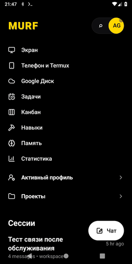
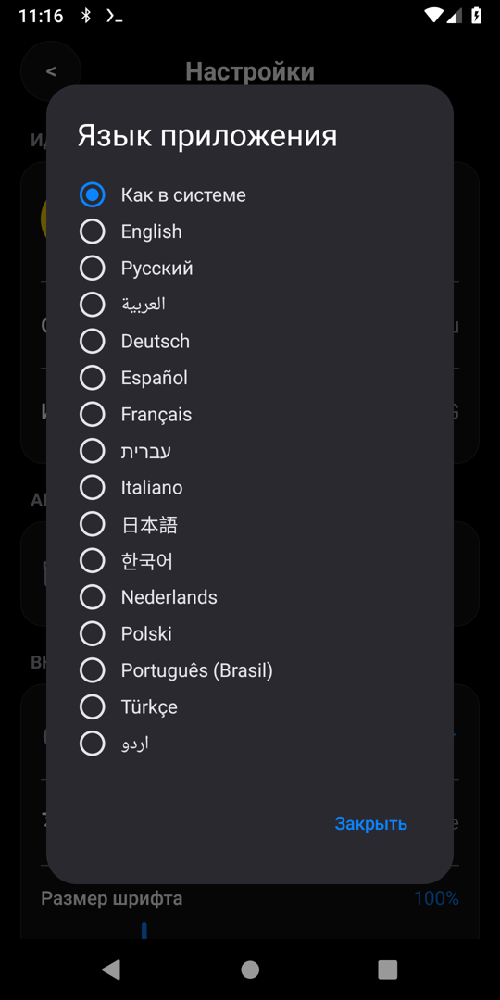

<p align="center"></p>

<h1 align="center">MURF — Android app for your own AI agent</h1>

<p align="center"><b>English</b> · <a href="README.ru.md">Русский</a></p>

<p align="center">
  <a href="https://github.com/winnifredbalistreri60-prog/murf/releases/latest"></a>
  <a href="https://github.com/winnifredbalistreri60-prog/murf/releases"></a>
  <a href="https://github.com/winnifredbalistreri60-prog/murf/actions/workflows/android.yml"></a>
  <a href="LICENSE"></a>
  
  <a href="https://github.com/winnifredbalistreri60-prog/murf/stargazers"></a>
</p>

<p align="center">
  <b>Open-source Android client for <a href="https://github.com/NousResearch/hermes-agent">Hermes Agent</a>: chat with your AI agent, watch and control its live desktop, let it use your phone through Termux — or run the whole agent on the phone in local Ubuntu.</b><br>
  Your server, any model provider — a self-hosted, open-source alternative to cloud agent apps like Manus.
</p>

<p align="center">
  <a href="https://github.com/winnifredbalistreri60-prog/murf/releases/latest"><b>⬇️ Download APK</b></a> ·
  <a href="https://winnifredbalistreri60-prog.github.io/murf/">Website</a> ·
  <a href="#faq">FAQ</a>
</p>

<p align="center"></p>

## Quick start

1. Download `murf-X.Y.Z.apk` from the [latest release](https://github.com/winnifredbalistreri60-prog/murf/releases/latest) and install it (Android 8.0+). Check the SHA-256 from the release notes.
2. **Your server:** enter your hermes-webui URL and password (nginx and service examples in [`server/`](server/README.md)).
3. **Or no server at all:** Local environment → Install (needs Termux, arm64, ≥ 4.5 GB free).

## Comparison

| | **MURF** | Manus (app) | OpenManus | Hermes Agent via Telegram |
|---|---|---|---|---|
| Open source | ✅ MIT | ❌ | ✅ | ✅ |
| Self-hosted | ✅ | ❌ cloud | ✅ | ✅ |
| Native Android app | ✅ | ✅ | ❌ | via Telegram |
| Live agent desktop | ✅ view + control | ✅ view | ❌ | ❌ |
| Agent uses your phone (Termux, camera, files) | ✅ with confirmation | ❌ | ❌ | ❌ |
| Whole agent on the phone | ✅ local mode | ❌ | ❌ | ❌ |
| Model | any provider supported by Hermes Agent | Manus | any (config) | any provider supported by Hermes Agent |

<sub>Based on public information as of Oct 2026; corrections welcome.</sub>

Compared with the Codex and Claude desktop apps — see [below](#how-murf-compares-to-codex-desktop-and-claude-desktop).

## About

**MURF** is an Android client for your own AI agent built on [Hermes Agent](https://github.com/NousResearch/hermes-agent) and [hermes-webui](https://github.com/nesquena/hermes-webui).
It is a fork of [Hermex](https://github.com/uzairansaruzi/hermex) (a native hermes-webui client) focused on the phone: a live agent screen, a phone bridge via Termux, and a local mode that runs the whole agent on the phone.

| Home | Agent screen | Chat export | Local mode |
|---|---|---|---|
|  |  |  |  |

| Phone & Termux | Google Drive | Font size | Language |
|---|---|---|---|
|  |  |  |  |

<sub>Screenshots currently show the Russian UI; the app itself is fully available in English (Settings → Appearance → Language). English screenshots: [#2](https://github.com/winnifredbalistreri60-prog/murf/issues/2).</sub>

## Features

- **Agent chat** — streaming answers, tool steps, reasoning, **subagents**, **approvals** for risky actions (in chat and as a notification).
- **Live agent screen** (noVNC) — opens from the monitor button in the chat header (green dot = the agent is working) or as its own screen; two modes:
  - *View* — view-only; input is dropped **on the server** by a view-only proxy, not just in the app;
  - *Control* — tap = click, long press = right click, two fingers = scroll, zoom and pan, key bar (Esc/Tab/Ctrl/Alt/Shift/Enter/arrows), Cyrillic input, screenshot; control is allowed only from your Origin.
- **Phone bridge** — the agent on the server asks the phone to do something (Termux command, photo, location, files, clipboard, notifications, battery, SMS if enabled); every action is confirmed unless you allowed it “always”.
- **Google Drive** — send messages, chats, files and screenshots to Drive; connect Drive to the agent through rclone (token, no password).
- **Export** — chat to Markdown/PDF/clipboard, Share, save to Downloads.
- **Server update checker** for Hermes Agent and WebUI: dry run, backup and automatic rollback.
- **Local mode** — the whole agent on the phone: Ubuntu (proot) in Termux, Hermes Agent, WebUI, XFCE desktop + browser, provider login (device code) from inside the environment; “Server / Phone (local)” profile switch and an offer to switch when the server is unreachable. **Tested on a real phone** (vivo X300, Android 16, arm64, MURF 1.2.4).
- **Language picker** — system default or any bundled language; MURF screens in English and Russian, English fallback.
- Everything from Hermex: sessions, projects, tasks, kanban, skills, memory, stats, multiple servers and profiles.

What's new in 1.2.x:

| Version | What's new |
|---|---|
| 1.2.0 | Local mode: install with progress and resume, provider login, proxy, settings import from the server, “Phone (local)” profile |
| 1.2.1 | Fallback install without proot-distro (plain proot) |
| 1.2.2 | **Language picker**; MURF screens in Russian and English |
| 1.2.3 | Agent screen opens 2–3× faster (parallel noVNC loading, cache) |
| 1.2.4 | Local screen: fixed endless “Connecting…”; local-environment **Diagnostics** with a report; “Restart screen” and “Show log” right on the screen |
| 1.2.5 | Agent screen in chat opens **on demand** from the monitor button in the header; optional mini-preview (Settings → Interaction, off by default; draggable, dismiss with ×) |

From 1.1.x: app-wide **font size**, **swipe** navigation between sections and to the agent screen (can be turned off), Control mode, screen over the chat.

## Architecture

```mermaid
flowchart LR
  subgraph Phone["Phone"]
    App["MURF (Android)"]
    Termux["Termux (+ Termux:API)"]
    Local["Local mode:<br>Ubuntu proot → Hermes + WebUI + XFCE"]
  end
  subgraph Server["Server"]
    Nginx["nginx (TLS)<br>/  /agent/  /screen/  /phone/"]
    WebUI["hermes-webui :8787"]
    Agent["Hermes Agent<br>(gateway, API :8642)"]
    Desk["Agent desktop<br>Xvnc + websockify/noVNC"]
    Relay["phone-relay :8790/:8791"]
  end
  App -- HTTPS / SSE --> Nginx
  App -- WebSocket (RFB) --> Nginx
  Nginx --> WebUI --> Agent
  Nginx --> Desk
  Nginx --> Relay
  Agent -- MCP agent_tools --> Relay
  Relay -. requests to the phone .-> App
  App -- RUN_COMMAND --> Termux
  App -. http://127.0.0.1:18080 .-> Local
```

## Build

JDK 17 and Android SDK (platform 36).

```bash
cd android
./gradlew assembleDebug                      # app/build/outputs/apk/debug/
# optional default server URL on the connect screen:
./gradlew assembleDebug -Pmurf.defaultServerUrl=https://your-server.example
```

Signed release: set `HERMEX_ANDROID_KEYSTORE_FILE`, `HERMEX_ANDROID_KEY_ALIAS` and the keystore passwords via environment variables or `~/.gradle/gradle.properties` (never in the repo), then `./gradlew assembleRelease`.

`applicationId` is `ru.dredd20.agent` (kept so updates install over existing builds). Change it in `android/app/build.gradle.kts` for your own build.

## Server

You need your own server with Hermes Agent and hermes-webui; MURF connects over HTTPS with the WebUI password. Example configs (with `your-server.example` placeholders) live in [`server/`](server/README.md):

- `server/examples/nginx-murf.conf` — nginx: WebUI, agent API, screen, phone bridge;
- `server/agent-screen/` — screen page (noVNC), view-only proxy, systemd units;
- `server/phone-relay/` — phone bridge and the `agent_tools` MCP server for the agent;
- `server/local-mode/` — local mode scripts (Termux + proot).

## Local mode: install and troubleshooting

The whole agent runs on the phone, no server: Termux → Ubuntu 24.04 (proot) → Hermes Agent + WebUI + XFCE desktop. The app connects to `http://127.0.0.1:18080` (local only).

**Requirements:** an arm64 phone with a modern kernel (tested on Android 16; Android 9 / 4.x kernels don't work), [Termux](https://f-droid.org/packages/com.termux/) from F-Droid or GitHub (not Google Play), **≥ 4.5 GB** free (the environment takes ~4 GB), internet during install.

### Install

1. Install Termux; in MURF open “Phone & Termux” and grant “Run commands in Termux”.
2. Menu → Local environment → **Install**. Termux opens with the log; install takes 20–60 min and resumes if interrupted. Progress is shown in MURF.
3. **Start** (WebUI comes up in 1–3 min) → **Log in to provider** → open the link and confirm the code.
4. Under Connection pick **Phone (local)**.

Manually in Termux: `curl -fsSL https://github.com/winnifredbalistreri60-prog/murf/releases/latest/download/install.sh | bash`, then `murf-local install && murf-local start`.

### Update

After updating MURF: Local environment → **Update** (scripts are copied into Termux, nothing already installed is downloaded again) → **Stop** → **Start**. In Termux: `murf-local update && murf-local restart`.

### If something doesn't work

- **Diagnostics** (Local environment → Diagnostics) checks Ubuntu, services, ports, screen files and WebSocket, VNC and Android limits and gives a short ✅/⚠️/❌ report with hints. **Send report** to share it (or Copy).
- **Screen doesn't connect** — after 15 s the screen shows the reason and **Restart screen** / **Show log** buttons.
- Termux commands:

| Command | What it does |
|---|---|
| `murf-local status` | status as JSON |
| `murf-local doctor` | same checks as Diagnostics |
| `murf-local restart-screen` | restart the desktop and websockify inside the running environment |
| `murf-local logs screen` | tail of screen logs (desktop, websockify, proxy, nginx) |
| `murf-local logs gateway` / `webui` / `setup` | agent, WebUI, install logs |
| `murf-local restart` / `stop` | restart / stop the environment |
| `murf-local proxy URL\|off` | proxy for the provider |

### Keep Android from killing the environment

- **Developer options → Disable child process restrictions** (Android 12+). Otherwise Android kills “extra” Termux processes (phantom process killer). On Android 12–13 without this option: `adb shell device_config put activity_manager max_phantom_processes 2147483647`.
- **Wakelock:** keep the Termux notification and enable “Acquire wakelock” (`murf-local start` does it).
- **Battery:** MURF and Termux — “Unrestricted”. **vivo / OriginOS:** allow **autostart** and **high background power use** for Termux and MURF (MURF has a “vivo: autostart/background” button).

### Provider, VPN, proxy

If the provider API is blocked in your network (e.g. HTTP 403), use a phone-wide VPN (including Termux) or set a proxy: Local environment → Proxy (e.g. `socks5h://127.0.0.1:10808` from v2rayNG) or `murf-local proxy URL`. “Check access” shows whether the direct connection and the proxy work.

### Tested devices

| Device | Android | Arch | MURF | Result |
|---|---|---|---|---|
| vivo X300 | 16 | arm64 | 1.2.4 | ✅ local mode: install, agent, WebUI, agent screen |
| Test machine (proot) | — | x86_64 | 1.2.4 | ✅ full script check: install, services, screen (view/control), diagnostics |
| Emulator | 9 (kernel 4.4) | x86_64 | 1.2.1 | ❌ Ubuntu 24.04 in proot doesn't work (old kernel) |

Reports from other phones are welcome — open an issue and attach the Diagnostics report ([#1](https://github.com/winnifredbalistreri60-prog/murf/issues/1)).

### Limitations

- Android 9 and old kernels (4.x) are not supported: Ubuntu 24.04 in proot doesn't run there.
- No Docker or systemd (services are started by our own supervisor).
- Needs ≥ 4.5 GB; the first install takes 20–60 min.
- The agent's desktop and browser are slower on the phone than on a server; under memory pressure Android may kill the environment.
- The phone bridge and Google Drive are primarily designed for the server profile.

## Security

- The WebUI password and cookie are stored in encrypted storage (EncryptedSharedPreferences); no secrets are kept in the repo.
- The agent screen and bridge API are protected by the WebUI session (nginx `auth_request`); screen control is allowed only from your Origin.
- Every phone action is confirmed; file links are one-time and short-lived.
- Local mode listens only on `127.0.0.1`; importing secrets from the server requires a separate confirmation.

Report a vulnerability: see [SECURITY.md](SECURITY.md).

## How MURF compares to Codex desktop and Claude desktop

MURF is similar in spirit to OpenAI's [Codex app](https://openai.com/index/introducing-the-codex-app/) and Anthropic's [Claude Desktop](https://code.claude.com/docs/en/desktop): it is a client for an AI agent that does the work on a computer, shows its steps and tool calls, asks for approval before risky actions, and works with files.

The differences:

- **Mobile client.** MURF is an Android app; Codex and Claude Desktop are desktop apps.
- **Your own agent.** MURF connects to the open-source [Hermes Agent](https://github.com/NousResearch/hermes-agent) on your own Ubuntu server, or runs it on the phone (local mode). Use any model provider Hermes Agent supports.
- **The agent's own desktop.** The agent works on a separate desktop on the server, and you watch it live or take control from your phone. Codex and Claude operate apps on your own computer (computer use).
- **Agent ↔ phone.** The agent can ask your phone to run a Termux command, take a photo or hand over a file — each action is confirmed by you.

| | **MURF** | Codex app | Claude Desktop |
|---|---|---|---|
| Runs on | Android | macOS, Windows; Linux in preview | macOS, Windows; Linux in beta |
| Shows agent steps and tool calls | ✅ | ✅ | ✅ |
| Approvals before actions | ✅ | ✅ approval policy + sandbox | ✅ permission modes |
| Agent operates a GUI desktop | ✅ its own Ubuntu desktop on your server | ✅ computer use (macOS) | ✅ computer use (beta, Pro/Max, macOS & Windows) |
| Live agent screen on your phone | ✅ view + control | — | — |
| MCP tools | ✅ via Hermes Agent | ✅ plugins and MCP servers | ✅ connectors are MCP servers |
| Agent acts on your phone | ✅ Termux, camera, files — with confirmation | — | — |
| Self-hosted / fully on your own device | ✅ server or phone | — | — |
| Models | any provider supported by Hermes Agent | OpenAI models (ChatGPT sign-in) | Claude models |
| Open-source app | ✅ MIT | — ([Codex CLI](https://github.com/openai/codex) is open source) | — |

<sub>✅ = confirmed by official docs as of Oct 2026 ([Codex app](https://openai.com/index/introducing-the-codex-app/), [Codex: computer use and more](https://openai.com/index/codex-for-almost-everything/), [Codex approvals & sandbox](https://developers.openai.com/codex/agent-approvals-security), [Claude Desktop](https://code.claude.com/docs/en/desktop), [Claude computer use](https://support.claude.com/en/articles/14128542-let-claude-use-your-computer-in-cowork), [Install Claude Desktop](https://support.claude.com/en/articles/10065433-install-claude-desktop)); “—” = not listed in those sources. MURF is not affiliated with or endorsed by OpenAI or Anthropic; Codex, ChatGPT and Claude are trademarks of their respective owners.</sub>

## Tablets

**Tablet version: in development.** Planned layout: chat and the live agent screen side by side, landscape. Discussion: [Tablet version issue](https://github.com/winnifredbalistreri60-prog/murf/issues/6).

## Use a TV box as the server (experimental)

> **Not yet tested on a TV box.** Below, every requirement is marked as measured by us, cited from official docs, or our estimate.

Two ways:

1. **TV box running Linux** (flashed with Armbian/Debian): install Hermes Agent with the official [Linux installer](https://github.com/NousResearch/hermes-agent#linux-macos-wsl2), hermes-webui per its [quick start](https://github.com/nesquena/hermes-webui#quick-start), nginx and the screen from [`server/`](server/README.md). MURF connects to it as a server. No proot needed.
2. **Android TV box:** Termux + MURF local-mode scripts (Ubuntu 24.04 in proot), same as on a phone.

| Requirement | Value | Source |
|---|---|---|
| Architecture | aarch64 (arm64) | Hermes Agent's Termux package is aarch64 ([Hermes Agent README](https://github.com/NousResearch/hermes-agent)); local mode tested on arm64 |
| Android (way 2) | ≥ 7 for Termux | [Termux README](https://github.com/termux/termux-app) |
| Kernel (way 2) | an Android 9 emulator with kernel 4.4 **fails**: apt in Ubuntu 24.04 dies with `realpath: ENOSYS`; Android 16 (vivo X300) works. Exact minimum not determined | measured by us |
| Storage | local-mode install takes ~4 GB; README asks for ≥ 4.5 GB free. We recommend ≥ 8 GB free for logs, browser cache and updates | ~4 GB measured; 8 GB is an **estimate** |
| RAM | not measured. We recommend ≥ 4 GB if you want the XFCE desktop + browser | **estimate** |
| Power and cooling | 24/7 use: heatsink/fan, wired Ethernet | **recommendation** |

Common aarch64 TV-box chips include Amlogic S905X3 / S905X4 / S922X and Rockchip RK3566 / RK3588 — this is not a list of tested devices. Discussion: [TV box server mode issue](https://github.com/winnifredbalistreri60-prog/murf/issues/7).

## Roadmap

- Tablet version (chat + agent screen side by side, landscape) — in development.
- TV box as the server — experimental.
- More UI languages ([#4](https://github.com/winnifredbalistreri60-prog/murf/issues/4)), testing local mode on more phones ([#1](https://github.com/winnifredbalistreri60-prog/murf/issues/1)).

## FAQ

**Is this a Manus alternative?**
MURF is an open-source client for an agent you host yourself (Hermes Agent): your server, your model provider, your agent desktop.

**Do I need a server?**
No — local mode runs Hermes Agent, WebUI and an XFCE desktop on the phone (Termux + Ubuntu in proot). A server is faster for long tasks.

**Which models?**
Whatever Hermes Agent supports — configured in the agent, not in the app.

**Can the agent act on my phone without asking?**
No — every action (Termux command, photo, files, location) needs your confirmation unless you allowed it “always”.

**Is it on Google Play?**
APK from [Releases](https://github.com/winnifredbalistreri60-prog/murf/releases) only for now (signed; SHA-256 in the release notes).

**Does it work on tablets?**
Tablet version: in development.

**How can I help?**
Star the repo, send Diagnostics reports from other phones, translations, issues labeled `good first issue` / `help wanted`. See [CONTRIBUTING.md](CONTRIBUTING.md).

## Credits

[Hermex](https://github.com/uzairansaruzi/hermex) (Uzair Ansar) · [Hermes Agent](https://github.com/NousResearch/hermes-agent) (Nous Research) · [hermes-webui](https://github.com/nesquena/hermes-webui) · [noVNC](https://github.com/novnc/noVNC) · [Termux](https://termux.dev). See [NOTICE.md](NOTICE.md).

License: [MIT](LICENSE).
